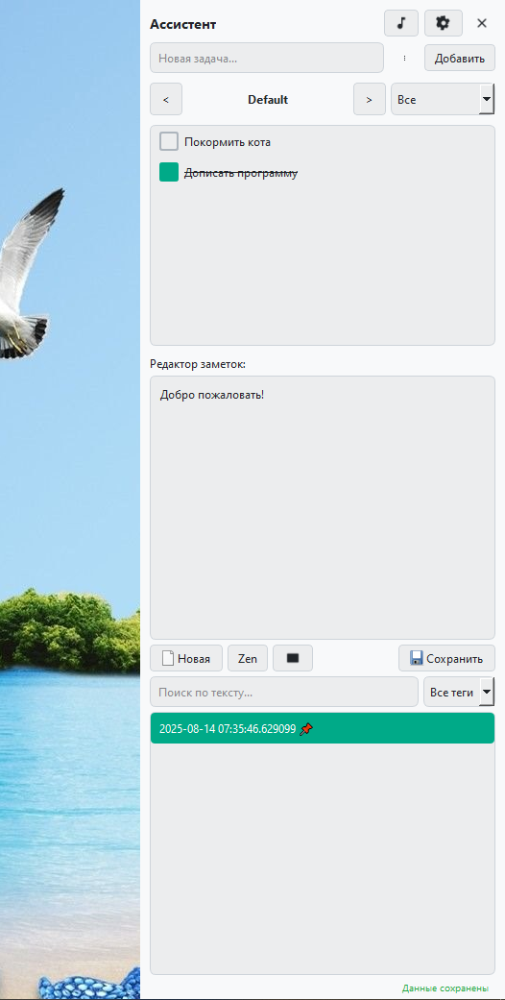
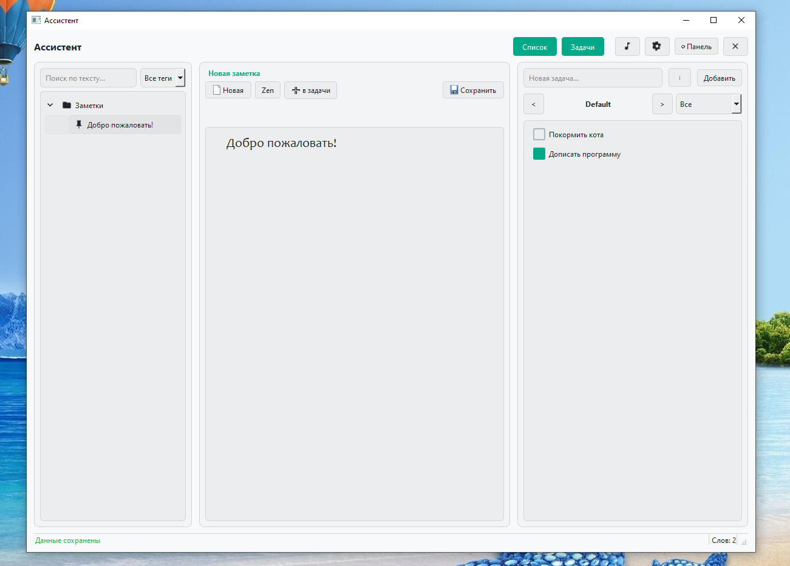
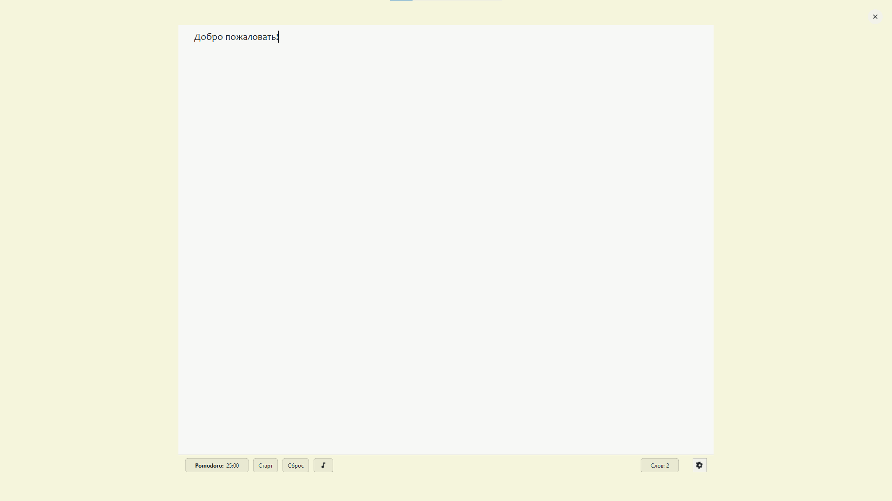
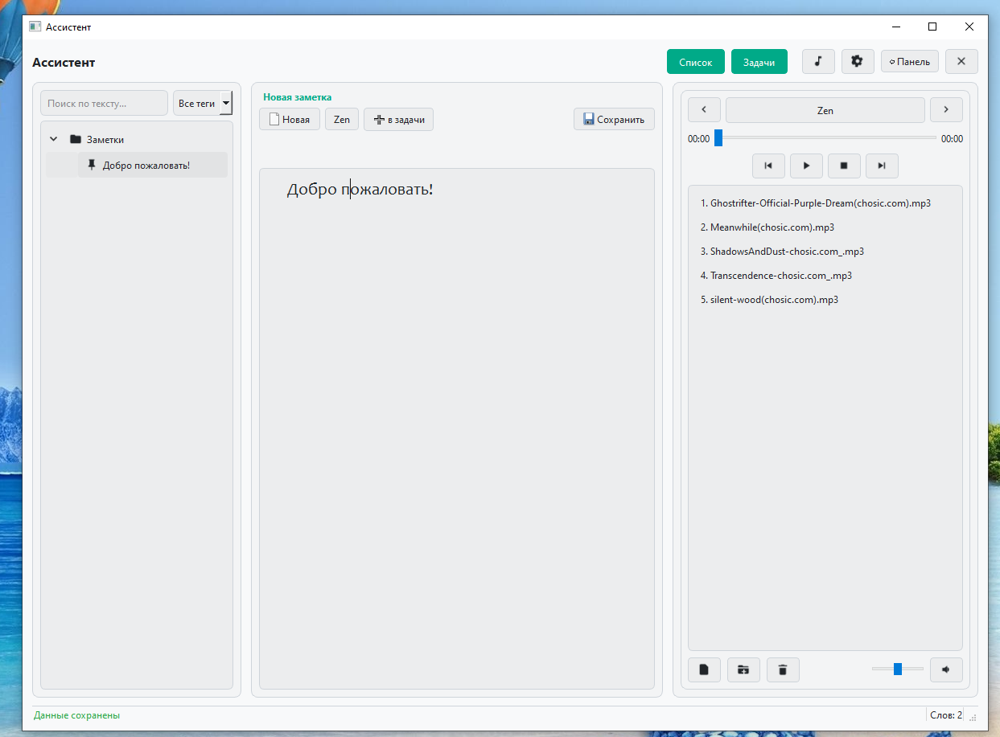
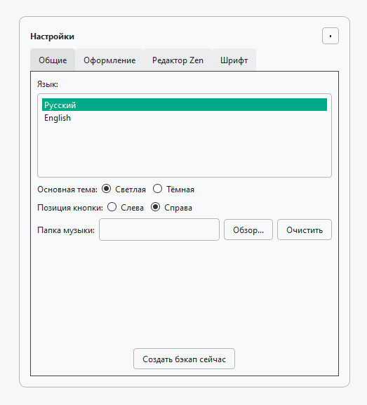
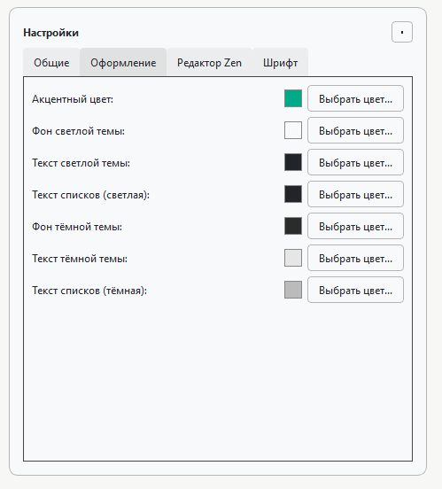
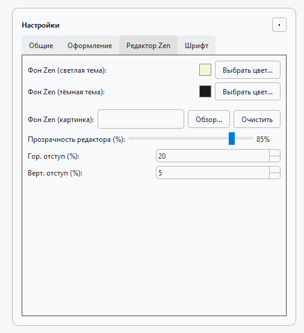
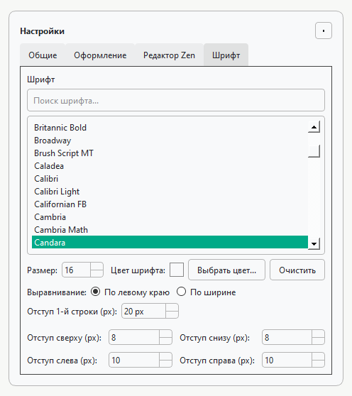
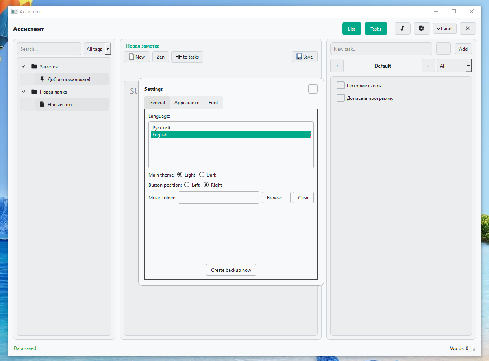
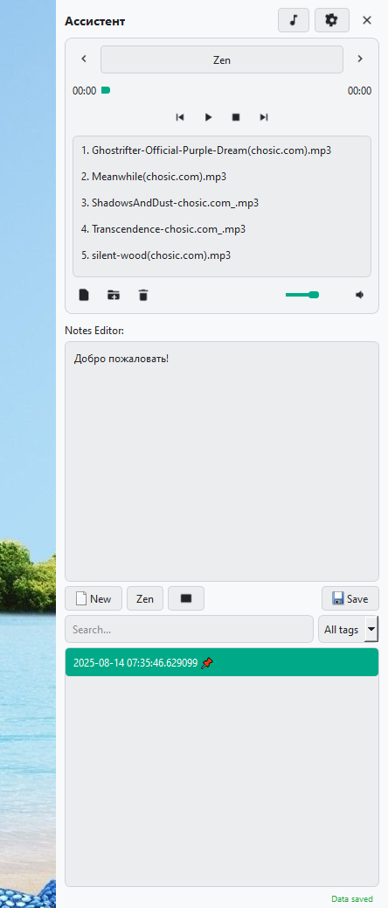

### Скриншоты /Screenshots

  
Русская версия

  
   
  
  | Панельный режим | Оконный режим |
  |:---:|:---:|
  |  |  |
  | **Режим Zen** | **Оконный режим с плеером** |
  |  |  |
  | **Настройки (Общие / Оформление)** | **Настройки (Zen / Шрифты)** |
  |  |  |
  |  |  |
  

  
English Version

  
   
  
  | Window Mode | Panel Mode with Audio |
  |:---:|:---:|
  |  |  |

# Assistant 2.0

A versatile desktop assistant designed for notes, tasks, and focused work, created in a unique collaboration between a human developer and AI.

This project was born out of the desire to create a single, highly customizable tool that combines everyday task management with a powerful, distraction-free environment for creative writing and deep work. It's a testament to modern development workflows, where human creativity is augmented by artificial intelligence to achieve a polished and feature-rich result.

---

## ✨ Key Features

*   **📝 Powerful Note Editor:** A central hub for all your thoughts and ideas. The editor supports basic text formatting and is deeply integrated with the task and tagging system.

*   **✅ Flexible Task Management:** A complete to-do list system with features like:
    *   Multiple, independent task lists.
    *   Marking tasks as complete.
    *   Filtering tasks (All, Active, Completed).
    *   Task templates for recurring items.

*   **🧘 Zen Mode:** A beautiful, fully immersive, distraction-free fullscreen editor designed for maximum focus.
    *   Customizable solid color or image backgrounds.
    *   Adjustable editor opacity for a "glass" effect over the background.
    *   Configurable text padding to create the perfect writing canvas.

*   **🍅 Integrated Pomodoro Timer:** A Pomodoro timer is built directly into the Zen Mode interface to help you manage your work and break intervals.

*   **🎨 Deep Customization:** Tailor the application to your exact preferences. The settings panel allows you to control:
    *   **Themes:** Full support for Light and Dark modes.
    *   **Colors:** Customize the background, text, and accent colors for both themes.
    *   **Fonts:** Choose any font installed on your system for the editor, set its size, color, and alignment.
    *   **Layout:** Adjust the minimum width of the columns in the main window to fit your workflow.

*   **🎵 Built-in Media Player:** A global audio player accessible from all modes to play your favorite focus music.

*   **🌍 Localization:** The interface is available in both English and Russian, with the ability to switch on the fly.

---

## 🛠️ Technologies Used

*   **Python 3**
*   **PyQt6** for the graphical user interface.

---

## 🚀 Getting Started

1.  Go to the [Releases](https://github.com/YOUR_USERNAME/YOUR_REPOSITORY/releases) page.
2.  Download the latest archive (`MyAssistant.zip`) for Windows.
3.  Extract the archive to any folder.
4.  Run `MyAssistant.exe`.

---

## 📄 License

This project is licensed under the MIT License. See the `LICENSE` file for details.

---

## 🙏 Acknowledgements

*   Icons provided by the Qt Framework and [Icons8](https://icons8.com).
*   Music tracks used in the `zen_audio` folder are provided by various artists under Creative Commons licenses. See the "About" dialog in the application for full attribution.

# Ассистент 2.0

Универсальный настольный ассистент для заметок, задач и сфокусированной работы, созданный в результате уникального сотрудничества человека и ИИ.

Этот проект родился из желания создать единый, гибко настраиваемый инструмент, который объединяет управление повседневными задачами с мощной, свободной от отвлечений средой для творчества и глубокой работы. Это демонстрация современного подхода к разработке, где креативность человека дополняется искусственным интеллектом для достижения качественного и многофункционального результата.

---

## ✨ Ключевые особенности

*   **📝 Мощный редактор заметок:** Центральное место для всех ваших мыслей и идей. Редактор поддерживает базовое форматирование и тесно интегрирован с системой задач и тегов.

*   **✅ Гибкий менеджер задач:** Полноценная система списков дел с такими возможностями, как:
    *   Создание нескольких независимых списков задач.
    *   Отметка задач как выполненных.
    *   Фильтрация задач (Все, Активные, Выполненные).
    *   Шаблоны для быстрого добавления типовых задач.

*   **🧘 Режим Zen:** Красивый, полноэкранный редактор без отвлекающих элементов, созданный для максимальной концентрации.
    *   Настраиваемый фон в виде сплошного цвета или изображения.
    *   Регулируемая прозрачность редактора для создания эффекта "стекла" поверх фона.
    *   Настраиваемые отступы текста для создания идеального холста для письма.

*   **🍅 Встроенный Pomodoro-таймер:** Таймер Pomodoro встроен прямо в интерфейс режима Zen, чтобы помочь вам управлять рабочими интервалами и перерывами.

*   **🎨 Глубокая кастомизация:** Настройте приложение в точном соответствии с вашими предпочтениями. Панель настроек позволяет контролировать:
    *   **Темы:** Полная поддержка светлой и тёмной тем.
    *   **Цвета:** Настройте цвет фона, текста и акцентный цвет для обеих тем.
    *   **Шрифты:** Выберите любой установленный в системе шрифт для редактора, установите его размер, цвет и выравнивание.
    *   **Макет:** Отрегулируйте минимальную ширину колонок в оконном режиме под ваш рабочий процесс.

*   **🎵 Встроенный медиаплеер:** Глобальный аудиоплеер, доступный из всех режимов, для воспроизведения вашей любимой музыки для концентрации.

*   **🌍 Локализация:** Интерфейс доступен на русском и английском языках с возможностью переключения "на лету".

---

## 🛠️ Используемые технологии

*   **Python 3**
*   **PyQt6** для графического интерфейса.

---

## 🚀 Установка

1.  Перейдите на страницу [Релизы](https://github.com/ВАШ_НИК/ВАШ_РЕПОЗИТОРИЙ/releases).
2.  Скачайте последний архив (`MyAssistant.zip`) для Windows.
3.  Распакуйте архив в любую папку.
4.  Запустите `MyAssistant.exe`.

---

## 📄 Лицензия

Проект распространяется под лицензией MIT. Подробности смотрите в файле `LICENSE`.

---

## 🙏 Благодарности

*   Иконки предоставлены фреймворком Qt и [Icons8](https://icons8.com).
*   Музыкальные треки в папке `zen_audio` предоставлены различными авторами под лицензиями Creative Commons. Полный список авторов можно найти в диалоговом окне "О программе" в самом приложении.
